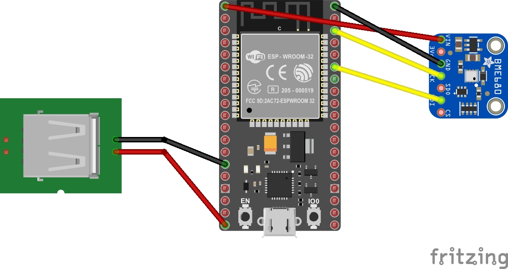
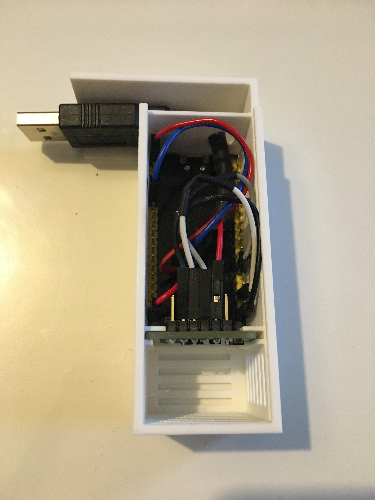
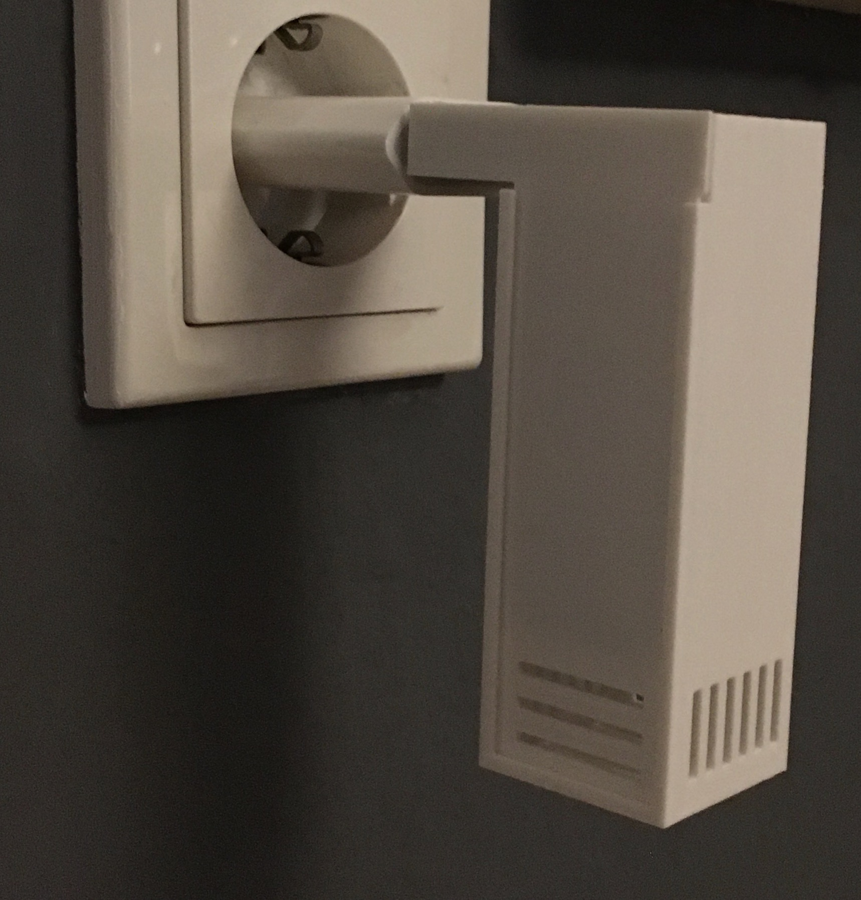

# HomeAtmo
Simple ESP32 based BME680 indoor air quality sensor.

## Overview
This is a very basic project, which reads the sensor values from a BME680 sensor (temperature, humidity VOC, CO2 air quality) and computes the [Indoor Air Quality (IAQ)](https://en.wikipedia.org/wiki/Indoor_air_quality) and implemented as an HomeKit Accessory.

## DIY
**Disclaimer: this project uses the proprietary [Bosch Sensortec Environmental Cluster (BSEC) Arduino Library](https://github.com/BoschSensortec/BSEC-Arduino-library) with their own [license](https://github.com/BoschSensortec/BSEC-Arduino-library/blob/master/LICENSE). If you do not agree with this license, you can not use this software. Everything not from the BSEC library uses the GPL 3.0 license**
### Software
#### HomeKit
All relevant HomeKit information has to be given in the `creds.h` file.
Use `include/creds.h.example` as a reference.

#### Wi-Fi
To be able to connect to your Wi-Fi network, provide your SSID and PSK in the `creds.h` file (see above).

#### Flashing
This project uses [PlatformIO](https://platformio.org), which makes it pretty easy to deploy the code.
Simply connect the ESP32 to you computer, import this repo into PlatformIO and use PlatformIO's upload command.
Thats it for the software part.
Head on to the hardware section.

### Hardware
For this project, I use an [ESP32 WROOM NodeMCU Development Board](https://www.amazon.de/dp/B071P98VTG) (~10€) and the [Bosch BME680 Sensor Breakout from BlueDot](https://www.amazon.de/gp/product/B075Y21H24) (~25€).
There are for sure cheaper solutions from AliExpress or similar, but I was not patient enough, so I went with Amazon. If you use different hardware, you have to adjust the case dimensions.

For the power supply, I use a rather standard USB 5V DC adapter to power the ESP32 via the 5V and GND pins.

#### Wiring
The wiring is quite easy.
Connect the VIN pin to the 3V pin of the ESP32, GND to GND.
For I2C, connect the SCK pin to the ESP's SCL (GPIO22) and SDI to SDA (GPIO21).
The ground cable of your USB power supply goes to the 5V pin on the ESP32 and GND to a free GND.

The following fritzing sketch will show you an example, but your actual pinout can be different, so be careful here!

#### Packaging
*Note: The case does not have a micro USB connector. Flash the ESP32 BEFORE assembling the sensor!*

Use the provided [STL](assets/HomeAtmo.stl) to print the case. Adjust the dimensions according to your hardware.
Pack everything into the case as seen on the following image:

You have to fiddle the wires for power supply through the small hole and connect the jumper wires to the corresponding 5V and GND pins.
The sensor itself is put vertically into the corresponding compartment.
Finally, the lid must be closed by pushing it into the slots provided.

I glued the USB connector to the case for more stability.
Connect the USB cable to the power supply, plug everything to the wall socket and you are done!
